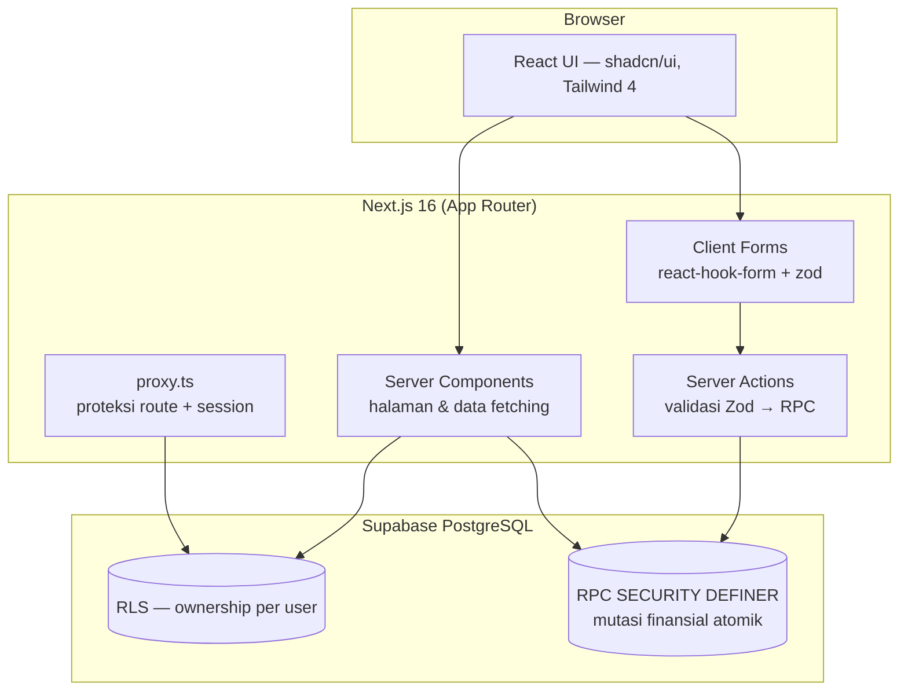
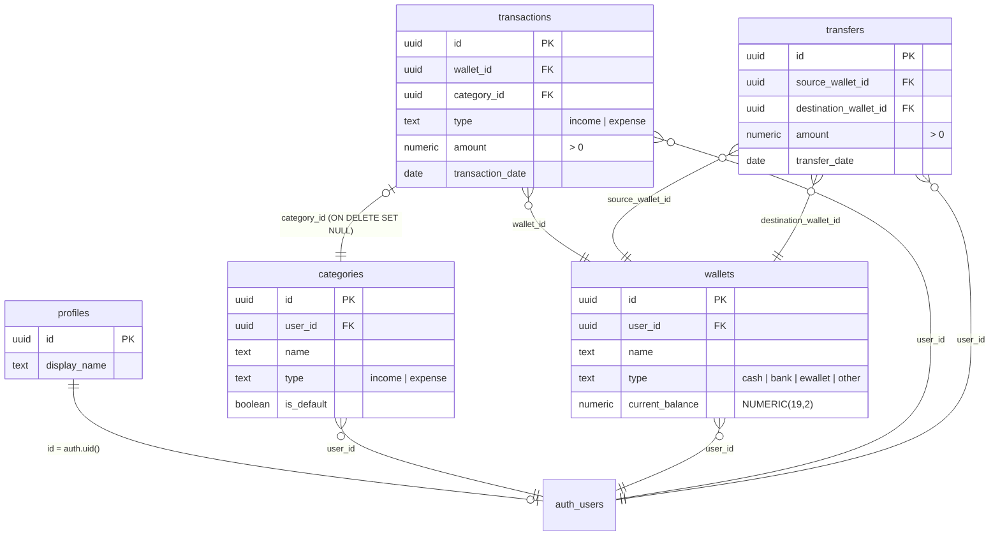

# Duitku — Portfolio Documentation (TASK-1503)

Dokumentasi ini menyoroti keputusan teknis yang layak dijelaskan saat interview / review portfolio. Detail lengkap ada di `requirements/` (SSOT).

---

## 1. Arsitektur Aplikasi

**Alur data (transaksi):**
1. User mengisi form (client) → react-hook-form validasi awal (UX).
2. Server Action menerima input → **validasi Zod ulang** (keamanan — validasi client bukan security).
3. Action memanggil RPC `create_transaction` dengan `auth.uid()`.
4. Di dalam satu transaksi SQL: insert transaksi **+** update saldo wallet — berhasil/gagal bersama-sama.
5. `revalidatePath` → UI ter-refresh dari data terbaru.

## 2. ERD

## 3. Keputusan Teknis Kunci

### 3.1. Mutasi finansial hanya lewat RPC `SECURITY DEFINER` (ADR-008/013)
- Client **tidak punya** INSERT/UPDATE/DELETE pada `wallets`, `transactions`, `transfers` (`REVOKE` di migration).
- Semua mutasi melewati fungsi database yang memvalidasi `auth.uid()` dan mengubah saldo dalam **satu transaksi SQL**.
- **Kenapa:** invariant saldo (saldo = f(transaksi)) tidak bisa dilewati dari aplikasi, dan ownership tidak bisa dipalsukan lewat parameter.

### 3.2. RLS sebagai garis pertahanan pertama (ADR-009)
- Setiap tabel user-owned punya policy `auth.uid() = user_id`.
- User A membaca data User B? RLS mengembalikan 0 baris — tanpa perlu filter manual di query.
- **Verified live:** tes cross-user dengan 2 akun (insert user_id asing → 403).

### 3.3. Uang ≠ float
- Kolom uang: `NUMERIC(19,2)`.
- Formatter Rupiah **deterministik**: dibangun manual (`Rp` + `Intl.NumberFormat("id-ID")` grouping) — bukan `style:"currency"` yang hasilnya berbeda antara ICU Node dan browser (NBSP vs spasi). Konsistensi server/client dijamin oleh unit test.

### 3.4. Validasi berlapis
- **Zod** di server action (wajib) + **react-hook-form** di client (UX).
- Nilai nominal: regex `^\d+(\.\d{1,2})?$` + `> 0` — menolak negatif, huruf, dan >2 desimal.
- Query params (filter halaman riwayat) disanitasi dengan UUID/date regex sebelum dipakai.

### 3.5. Next.js 16 — `proxy.ts`
- Menggantikan `middleware.ts` (konvensi Next 16).
- Fail-open saat Supabase belum dikonfigurasi — halaman publik tetap bisa diakses, `next build` tidak gagal sebelum env diisi.

### 3.6. Kategori default via trigger
- `handle_new_user` men-seed 12 kategori default (4 income + 8 expense) saat user daftar — pengguna baru langsung punya struktur tanpa onboarding.

## 4. Keamanan

| Aspek | Implementasi |
| --- | --- |
| Ownership | RLS + validasi `auth.uid()` di RPC |
| Injeksi SQL | Query via Supabase client (parameterized) — tidak ada string SQL dari input |
| XSS | React escape bawaan; tanpa `dangerouslySetInnerHTML` (di-audit) |
| Error bocor | Error DB di-`console.error`, user hanya lihat pesan generik |
| Secret | `.env*` di-gitignore; `.env.example` placeholder |
| CSRF | Server Actions memakai origin check bawaan Next.js |

## 5. Testing

- **Unit (Vitest, 53 test):** schema Zod (transaction/wallet/category/transfer), utilitas uang, utilitas tanggal.
- **Menangkap bug nyata:** unit test menemukan celah — nominal `0` lolos schema & currency `ID1` lolos validasi; keduanya diperbaiki.

## 6. Screenshots

_Tambahkan screenshot di sini setelah deploy (login, dashboard, transaksi, wallet)._

## 7. Technical Challenges (untuk interview)

1. **Menjaga konsistensi saldo** saat edit/hapus transaksi — solusi: RPC yang membalik efek lama lalu menerapkan efek baru dalam satu transaksi.
2. **Transfer atomik** — source -x, destination +x, total saldo tidak berubah; gagal setengah jalan = rollback otomatis.
3. **Format uang konsisten di semua environment** — deterministik formatter + test.
4. **Auth + RLS di arsitektur tanpa ORM** — tipe database ditulis tangan dan disinkronkan dengan migration.
