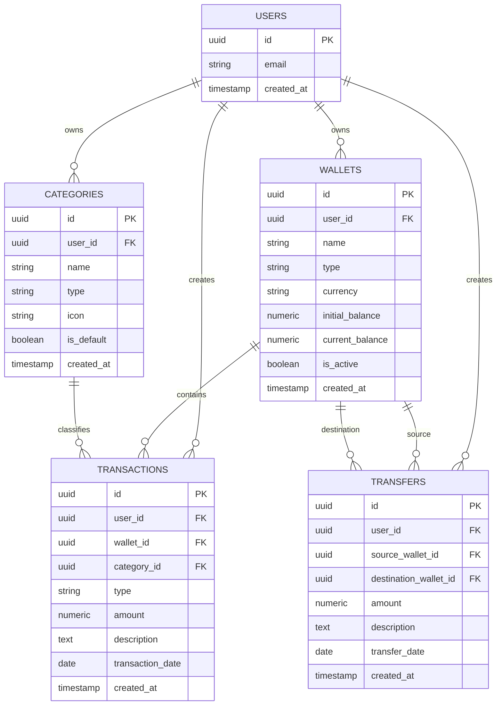

# Duitku — System Architecture

**Version:** 1.0
**Status:** Source of Truth

---

# 1. Architecture Goals

Arsitektur Duitku harus:

1. sederhana untuk solo developer;
2. murah untuk development dan portfolio;
3. mudah dikembangkan;
4. memiliki separation of concerns yang jelas;
5. aman terhadap akses data antar-user;
6. mudah di-deploy;
7. tidak over-engineered;
8. dapat dikembangkan menuju fitur premium dan payment pada masa depan.

---

# 2. Final Tech Stack

| Layer            | Technology                                                        |
| ---------------- | ----------------------------------------------------------------- |
| Framework        | Next.js                                                           |
| Language         | TypeScript                                                        |
| UI               | React                                                             |
| Styling          | Tailwind CSS                                                      |
| UI Components    | shadcn/ui                                                         |
| Animation        | Motion (default) — Rive/Lottie/GSAP disisipkan sesuai kebutuhan   |
| Backend          | Next.js Server / Route Handlers / Server Actions sesuai kebutuhan |
| Database         | PostgreSQL                                                        |
| Backend Platform | Supabase                                                          |
| Authentication   | Supabase Auth                                                     |
| Storage          | Supabase Storage jika diperlukan                                  |
| Charts           | Recharts                                                          |
| Validation       | Zod                                                               |
| Forms            | React Hook Form                                                   |
| Testing          | Vitest + Playwright                                               |
| Version Control  | Git + GitHub                                                      |
| Deployment       | Vercel                                                            |
| Database Hosting | Supabase                                                          |

---

# 3. Architecture Decision

Duitku menggunakan **modular monolith**.

Tidak menggunakan microservices.

Arsitektur:

```text
┌───────────────────────────────┐
│            User               │
└───────────────┬───────────────┘
                │
                ▼
┌───────────────────────────────┐
│        Next.js Web App        │
│                               │
│  Pages / UI / Components      │
│  Server Components            │
│  Server Actions / API Routes  │
└───────────────┬───────────────┘
                │
                ▼
┌───────────────────────────────┐
│        Application Logic      │
│                               │
│ Auth                          │
│ Wallet                        │
│ Transaction                   │
│ Category                      │
│ Transfer                      │
│ Dashboard                     │
└───────────────┬───────────────┘
                │
                ▼
┌───────────────────────────────┐
│          Supabase             │
│                               │
│ PostgreSQL                    │
│ Auth                          │
│ Storage                       │
│ Row Level Security            │
└───────────────────────────────┘
```

---

# 4. High-Level Data Flow

Contoh membuat Expense:

```text
User
 ↓
Expense Form
 ↓
Client Validation
 ↓
Server Action
 ↓
Authentication Check
 ↓
Authorization Check
 ↓
Business Validation
 ↓
PostgreSQL Transaction
 ↓
Transaction Created
 ↓
Wallet Balance Updated
 ↓
Response
 ↓
UI Refresh
```

---

# 5. Security Architecture

Data keuangan merupakan data sensitif.

Prinsip utama:

> User hanya boleh membaca dan memodifikasi data miliknya sendiri.

PostgreSQL menggunakan **Row Level Security (RLS)**.

Contoh konsep:

```text
auth.uid()
    ↓
user_id
    ↓
ownership validation
    ↓
allow / deny
```

Setiap entity user-owned harus memiliki relasi ke User secara langsung atau melalui entity yang user-owned.

---

# 6. Folder Structure

Struktur utama:

```text
duitku/
│
├── app/
│   ├── (auth)/
│   │   ├── login/
│   │   └── register/
│   │
│   ├── (dashboard)/
│   │   ├── dashboard/
│   │   ├── transactions/
│   │   ├── wallets/
│   │   ├── categories/
│   │   └── settings/
│   │
│   ├── api/
│   │
│   ├── layout.tsx
│   └── page.tsx
│
├── components/
│   ├── ui/
│   ├── animations/
│   ├── dashboard/
│   ├── transactions/
│   ├── wallets/
│   ├── categories/
│   └── shared/
│
├── features/
│   ├── auth/
│   ├── transactions/
│   ├── wallets/
│   ├── categories/
│   ├── transfers/
│   └── dashboard/
│
├── lib/
│   ├── supabase/
│   ├── validations/
│   ├── utils/
│   └── constants/
│
├── actions/
│   ├── transactions.ts
│   ├── wallets.ts
│   ├── categories.ts
│   └── transfers.ts
│
├── types/
│   ├── database.ts
│   └── domain.ts
│
├── tests/
│   ├── unit/
│   └── e2e/
│
├── supabase/
│   ├── migrations/
│   └── seed.sql
│
├── public/
│
├── .env.example
├── AGENTS.md
├── ARCHITECTURE.md
├── DESIGN.md
├── DECISIONS.md
├── PRD.md
└── TASKS.md
```

Folder dapat disesuaikan dengan struktur aktual repository, tetapi perubahan struktural besar harus didokumentasikan.

---

# 7. Core Entities

Entity utama:

```text
User
 │
 ├── Wallet
 │      │
 │      └── Transaction
 │
 ├── Category
 │
 └── Debt / Receivable (future)
```

---

# 8. User

Authentication dikelola Supabase Auth.

Conceptual fields:

```text
User
- id
- email
- display_name
- avatar_url
- created_at
- updated_at
```

Identity utama:

```text
auth.users.id
```

Profile tambahan dapat disimpan pada table `profiles`.

---

# 9. Wallet

Wallet merepresentasikan tempat user menyimpan uang.

Contoh:

* Cash
* BCA
* BRI
* Mandiri
* DANA

Fields penting:

```text
wallets
- id
- user_id
- name
- type
- currency
- initial_balance
- current_balance
- is_active
- created_at
- updated_at
```

Wallet type:

```text
cash
bank
ewallet
other
```

---

# 10. Category

Category mengelompokkan Transaction.

Fields:

```text
categories
- id
- user_id
- name
- type
- icon
- is_default
- created_at
- updated_at
```

Category type:

```text
income
expense
```

Transfer tidak membutuhkan Category.

---

# 11. Transaction

Transaction merupakan catatan finansial utama.

Fields:

```text
transactions
- id
- user_id
- wallet_id
- category_id
- type
- amount
- description
- transaction_date
- created_at
- updated_at
```

Transaction type:

```text
income
expense
transfer
```

Untuk transfer, desain dapat menggunakan metadata atau entity transfer khusus jika kebutuhan berkembang.

---

# 12. Transfer

Transfer harus diperlakukan berbeda dari Expense.

Contoh:

```text
BCA
- Rp500.000

        ↓ transfer

Cash
+ Rp500.000
```

Total balance tidak berubah.

Untuk implementasi yang lebih robust, disarankan menggunakan entity:

```text
transfers
- id
- user_id
- source_wallet_id
- destination_wallet_id
- amount
- description
- transfer_date
- created_at
```

Kemudian Transaction dapat mereferensikan Transfer jika diperlukan.

---

# 13. Future Debt / Receivable Model

Belum wajib diimplementasikan pada core MVP.

Future model:

```text
debts
- id
- user_id
- person_name
- amount
- due_date
- status
- description
- created_at
- updated_at
```

```text
debt_payments
- id
- debt_id
- wallet_id
- amount
- payment_date
- created_at
```

Receivable menggunakan konsep serupa.

---

# 14. ERD



---

# 15. Money Handling Rules

Nominal uang **tidak boleh disimpan sebagai floating point**.

PostgreSQL:

```text
NUMERIC(19,2)
```

atau integer minor units jika desain tersebut dipilih secara konsisten.

Untuk Rupiah:

```text
Rp25.000
```

harus direpresentasikan secara presisi.

Aturan:

* amount > 0;
* tidak boleh NaN;
* tidak boleh Infinity;
* tidak boleh negative amount untuk normal Transaction;
* currency harus jelas;
* transfer source dan destination tidak boleh sama.

---

# 16. Transaction Integrity

Pembuatan Expense harus atomik.

Contoh:

```text
BEGIN

Create transaction

Update wallet balance

COMMIT
```

Jika salah satu gagal:

```text
ROLLBACK
```

Tidak boleh terjadi kondisi:

```text
Transaction berhasil
tetapi Wallet tidak berubah
```

atau:

```text
Wallet berubah
tetapi Transaction gagal dibuat
```

Business-critical database operations harus menggunakan database transaction / RPC yang sesuai.

---

# 17. API / Server Contract

Duitku tidak membutuhkan backend service terpisah pada tahap ini.

Business logic dapat menggunakan Next.js Server Actions atau Route Handlers.

Contoh conceptual API:

```text
GET    /api/wallets
POST   /api/wallets
PATCH  /api/wallets/:id
DELETE /api/wallets/:id

GET    /api/transactions
POST   /api/transactions
GET    /api/transactions/:id
PATCH  /api/transactions/:id
DELETE /api/transactions/:id

GET    /api/categories
POST   /api/categories
PATCH  /api/categories/:id
DELETE /api/categories/:id

POST   /api/transfers
GET    /api/transfers

GET    /api/dashboard/summary
```

Server Actions boleh digunakan untuk mutation internal apabila lebih sederhana.

Jangan membuat API endpoint hanya demi mengikuti pola tertentu jika Server Action lebih tepat.

---

# 18. Validation

Validation dilakukan minimal pada:

### Client

Untuk UX cepat.

### Server

Untuk security dan correctness.

Zod digunakan sebagai validation layer.

Contoh conceptual schema:

```text
CreateTransactionInput

type:
  income | expense

amount:
  positive numeric

wallet_id:
  valid UUID

category_id:
  valid UUID when required

transaction_date:
  valid date

description:
  optional string
```

Client validation **tidak menggantikan server validation**.

---

# 19. Third-Party Integration

## Supabase Auth

Flow:

```text
User
 ↓
Login/Register
 ↓
Supabase Auth
 ↓
Session
 ↓
Next.js
 ↓
Protected Route
```

---

## Supabase PostgreSQL

Digunakan sebagai primary database.

---

## Supabase Storage

Belum diperlukan untuk core MVP.

Akan digunakan jika fitur:

* receipt upload;
* avatar;
* attachment;

ditambahkan.

---

## Payment Gateway

Belum diintegrasikan pada current MVP.

Future architecture:

```text
Duitku
 ↓
Payment Gateway
 ↓
QRIS
 ↓
Customer Payment
 ↓
Payment Gateway
 ↓
Webhook
 ↓
Duitku Backend
 ↓
Payment Transaction
 ↓
Settlement
```

Webhook harus diverifikasi dan tidak boleh dipercaya hanya berdasarkan request dari client.

---

# 20. Deployment

## Production

```text
GitHub
   ↓
Vercel
   ↓
Next.js
```

Database:

```text
Supabase
   ↓
PostgreSQL
```

Authentication:

```text
Supabase Auth
```

---

# 21. Environments

Minimal:

```text
Development
Production
```

Jika project berkembang:

```text
Development
Staging
Production
```

Environment variables:

```text
NEXT_PUBLIC_SUPABASE_URL
NEXT_PUBLIC_SUPABASE_ANON_KEY
```

Secret keys tidak boleh masuk repository.

`.env.local` harus masuk `.gitignore`.

---

# 22. Deployment Principle

Setiap production deployment harus:

1. melalui Git;
2. dapat di-trace ke commit;
3. tidak mengandung secret;
4. database migration terkontrol;
5. tidak melakukan destructive migration tanpa backup/review.

---

# 23. Architecture Future Direction

Duitku dapat berkembang:

```text
                 Duitku
                    │
       ┌────────────┼────────────┐
       ↓            ↓            ↓
 Personal       Analytics     Payments
 Finance                         │
       │                         ↓
 Wallet       AI Insights      QRIS
 Transaction                    │
 Budget                         ↓
 Debt                         Withdraw
```

Namun core architecture tetap dimulai sebagai **modular monolith**, bukan microservices.

---

# 24. Animation System (ADR-014)

Motion adalah default UI animation library.

Struktur:

```text
lib/animations/motion.ts       → variant terpusat (fadeIn, fadeInUp, scaleIn, staggerContainer)
components/animations/
  motion_provider.tsx          → MotionConfig reducedMotion="user" (aksesibilitas global)
  reveal.tsx                   → entrance animation untuk section/kartu
  animated_rupiah.tsx          → count-up Rupiah (respect reduced motion)
```

Aturan:

* Motion hanya dipakai di komponen **client** — Server Page → komponen animasi client, jangan mengubah seluruh page menjadi client.
* Variant dipakai dari `lib/animations/motion.ts`, jangan buat konfigurasi random per komponen.
* Rive/Lottie/GSAP belum dipasang (ADR-014) — tambahkan hanya jika ada use case nyata.
* Semua animasi harus hormati prefers-reduced-motion.
